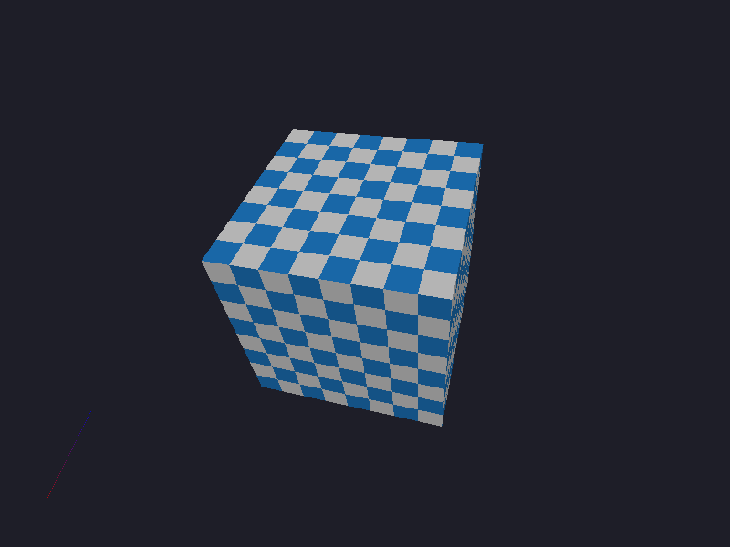
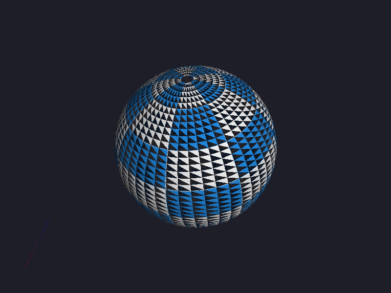
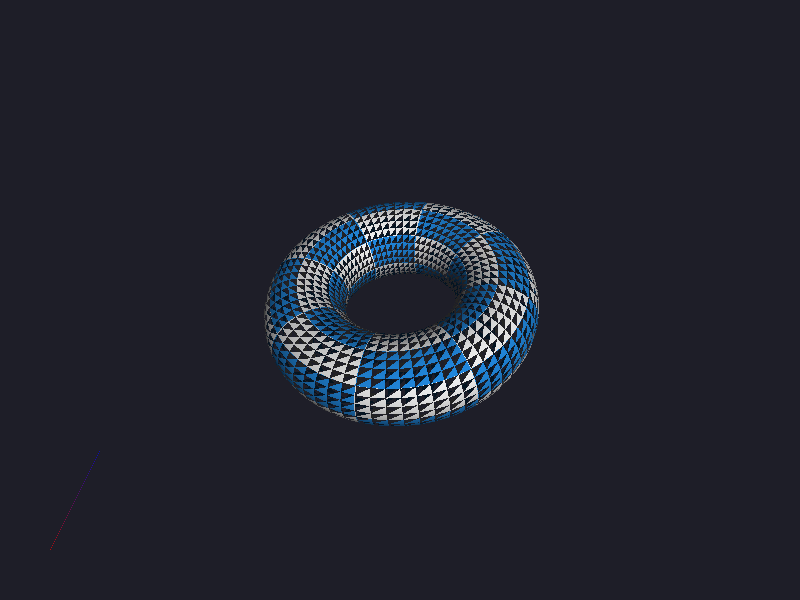

# swr

Software rasterizer written from scratch in C++. No GPU, no OpenGL, no graphics API — just math, memory, and a pixel buffer.

Outputs to BMP.

| Cube | Sphere | Torus |
|:----:|:------:|:-----:|
|  |  |  |

## What it does

- Triangle rasterization with top-left fill rule
- Perspective-correct texture mapping
- Z-buffering
- Backface culling
- Diffuse + ambient lighting with interpolated normals
- OBJ mesh loading (v/vt/vn, fan triangulation)
- BMP texture loading with checkerboard fallback
- Full MVP transform pipeline (model → view → projection)

## Build

```bash
cmake -B build && cmake --build build
```

Requires nothing. Links only `libm`.

## Usage

```bash
./build/swr                          # renders built-in cube
./build/swr models/cube.obj          # load OBJ mesh
./build/swr models/cube.obj tex.bmp  # load OBJ + texture
```

Output is written to `output.bmp`.
